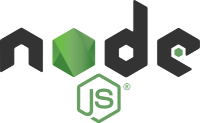

# Developer's Guide

This guide will allow you to have an overview of how the repo is structured, set up your workstation, develop, test and contribute to the project.

## Table of contents
- [Developer's Guide](#developers-guide)
  - [Table of contents](#table-of-contents)
  - [Set up a minimal workstation to use this repo](#set-up-a-minimal-workstation-to-use-this-repo)
    - [Prerequisites](#prerequisites)
    - [Useful softwares](#useful-softwares)
      - [Node.js](#nodejs)
      - [Visual Studio Code](#visual-studio-code)
    - [Troubleshooting](#troubleshooting)
  - [Getting started](#getting-started)
  - [Repo structure](#repo-structure)
    - [Root](#root)
    - [`.github`](#github)
    - [`assets`](#assets)
    - [`configs`](#configs)
    - [`coverage`](#coverage)
    - [`lib`](#lib)
    - [`node_modules`](#node_modules)
    - [`src`](#src)
  - [Development conventions](#development-conventions)
    - [Code and quality gate](#code-and-quality-gate)
    - [Git branching pattern](#git-branching-pattern)
    - [Working on a new task](#working-on-a-new-task)
    - [Commit conventions](#commit-conventions)
  - [CI/CD and release management](#cicd-and-release-management)

## Set up a minimal workstation to use this repo

### Prerequisites

- Having [git](https://git-scm.com/downloads) installed

### Useful softwares

#### Node.js



Node.js is a JavaScript runtime based on the Google Chrome [V8 engine](https://v8.dev/).

To install it properly, I suggest you use NVM (Node Version Manager), which, as its name suggests, will simplify your life to manage several versions of Node.js on your computer.

- **Link for Windows users:** [nvm-windows](https://github.com/coreybutler/nvm-windows#installation--upgrades)
- **Link for UNIX or macOS users:** [nvm-sh](https://github.com/nvm-sh/nvm#installing-and-updating)

Once NVM is installed, open a terminal and run the following commands, replacing `<X.Y.Z>` with the version you want:
```
$ nvm install <X.Y.Z>
$ nvm use <X.Y.Z>
```

Now you have version `<X.Y.Z>` of Node.js installed and used on your computer. If you need another one in the future, you can run the commands `nvm install` (to install a new version) and `nvm use` (to use a particular one). To list the different versions available on your computer, you can run the `nvm ls` command. An asterisk will be present next to the version in use.

#### Visual Studio Code


VS Code is an extensible code editor developed by Microsoft for Windows, Linux and macOS. It is one of the most widely used IDEs in the JS ecosystem.

Download link: https://code.visualstudio.com/download

Some interesting extensions:
- [Add jsdoc comments](https://marketplace.visualstudio.com/items?itemName=stevencl.addDocComments)
- [Docker](https://marketplace.visualstudio.com/items?itemName=ms-azuretools.vscode-docker)
- [ESLint](https://marketplace.visualstudio.com/items?itemName=dbaeumer.vscode-eslint)
- [JavaScript (ES6) code snippets](https://marketplace.visualstudio.com/items?itemName=xabikos.JavaScriptSnippets)
- [Markdown All in One](https://marketplace.visualstudio.com/items?itemName=yzhang.markdown-all-in-one)
- [Node modules resolve](https://marketplace.visualstudio.com/items?itemName=naumovs.node-modules-resolve)
- [Node.js Extension Pack](https://marketplace.visualstudio.com/items?itemName=waderyan.nodejs-extension-pack)
- [Node.js Modules Intellisense](https://marketplace.visualstudio.com/items?itemName=leizongmin.node-module-intellisense)
- [npm](https://marketplace.visualstudio.com/items?itemName=eg2.vscode-npm-script)
- [npm Intellisense](https://marketplace.visualstudio.com/items?itemName=christian-kohler.npm-intellisense)
- [Path Intellisense](https://marketplace.visualstudio.com/items?itemName=christian-kohler.path-intellisense)
- [Search node_modules](https://marketplace.visualstudio.com/items?itemName=jasonnutter.search-node-modules)
- [YAML](https://marketplace.visualstudio.com/items?itemName=redhat.vscode-yaml)

Some conventions:
- Indentation: 2 spaces
- Encoding: UTF-8
- EoL Sequence: CRLF

Some alternatives:
- [Sublime Text](https://www.sublimetext.com/)
- [WebStorm](https://www.jetbrains.com/fr-fr/webstorm/)
- [Atom](https://atom.io/)

### Troubleshooting

- Check that your `nvm` version is recent (>= 1.1.9)
- If you have problems with Node and `npm` dependencies installation, check that `nvm ls` and `node -v` return the same version numbers. Delete the `package-lock.json` file and the `node_modules` folder properly before starting a new installation from scratch. Another point of attention, especially when switching from an old version of Node to a recent one on Windows, make sure to delete the cache of the `C:\Users\_\AppData\Local\node-gyp` folder.

## Getting started

Clone the repo on your computer using the following Git command:

```
$ git clone https://github.com/ehenon/quiz-answer-validator.git
```

Open the project via your IDE and open a terminal (for example using `Ctrl+Shift+ù` on VS Code).

Checkout the `main` branch:

```
$ git checkout main
```

Install the dependencies of the project:

```
$ npm install
```

Then you can run some available commands:

```
$ npm run lint            // run the linter
$ npm run test            // run the unit tests
$ npm run build           // build in a lib folder
```

## Repo structure

The repo is structured into different folders:

### Root

At the root of the repo, you can find:

- `.commitlintrc.json`: commitlint config file
- `.eslintignore`: config file to tell ESLint to ignore specific files and directories
- `.eslintrc`: ESLint rules config file
- `.gitignore`: config file to tell Git to ignore specific files and directories
- `.huskyrc`: husky config file for Git hooks
- `CODEOWNERS`: file which defines people who are responsible for the codebase
- `CHANGELOG.md`: file which contains a curated, chronologically ordered list of notable changes for each version of the project
- `DEVELOPERS.md`: guide for developers
- `jest.config.ts`: config file for Jest testing framework
- `LICENSE`: file specifying the license
- `package-lock.json`: file automatically generated for any operations where `npm` modifies either the `node_modules` tree, or `package.json` (please note that this file must be committed)
- `package.json`: ~ID card for the Node project, contains name, version, scripts, dependencies etc.
- `README.md`: main README file of the repository  

### `.github`

The `.github` directory contains:
- `.md` files serving as GitHub templates (especially for issues and pull requests)
- a `workflows` directory containing the different [GitHub Actions](https://docs.github.com/en/actions) workflows (see the [CI/CD](#cicd-and-release-management) section for more details)

### `assets`

The `assets` directory contains some images used for the documentation.

### `configs`

The `configs` directory contains config files for TypeScript transpilation:
- `tsconfig.base.json`: common compilation settings that can be used regardless of which module format we are targeting
- `tsconfig.cjs.json`: specific settings for CommonJS format
- `tsconfig.eslint.json`: specific settings for ESLint
- `tsconfig.esm.json`: specific settings for ECMAScript format

### `coverage`

The `coverage` directory is the report output directory used by Jest for the code coverage part. When you run the unit tests locally, you can find the coverage report as a static site at `coverage/lcov-report/index.html`.

Please note that this directory is not versioned.

### `lib`

The `lib` directory is the build target of the project. It is filled by the `npm run build` command.

Please note that this directory is not versioned.

### `node_modules`

The `node_modules` directory contains all locally installed npm dependencies and sub-dependencies.

Please note that this directory is not versioned.

### `src`

The `src` directory contains all the source files of the project. NB: it includes the `.spec.ts` unit tests files.

## Development conventions

### Code and quality gate

Some conventions:
- Indentation: 2 spaces
- Encoding: UTF-8
- EoL Sequence: CRLF

Quality gate:
- Audit for vulnerabilities (using [audit-ci](https://www.npmjs.com/package/audit-ci))
- ESLint (using [AirBnB](https://airbnb.io/javascript/) style)
- Unit tests (performed using [Jest framework](https://jestjs.io/))
- Build

### Git branching pattern

This project adopts a simple 2-level branching pattern with:
- `main` being the default branch, symbolizing the latest released version
  - `feat/_` being the branches created from `main` to work on the features of the future release
  - `fix/_` being the branches created from `main` to work on the fixes of the future release

### Working on a new task

When you work on a new task, you have to create a new `feat/_` or `fix/_` branch from the `main` branch. The name of the branch in question must start with the GitHub Issue number associated with the task, followed by a few keywords related to this task (example: `feat/142-add-mongodb-service`).

Once this branch is created, you can work on it and create a Pull Request targeting the `main` branch and respecting the Pull Request template set up on the project. This Pull Request will be used as a basis to follow the progress of the task in question (history of commits, quality gate, reviews, link with GitHub Issue number etc).

Please note that a Pull Request should only be submitted for human review if you consider your work to be complete, tested, successful, and if the automatic quality gate has passed.

### Commit conventions

Concerning the commits standards, please follow the [conventional commits](https://www.conventionalcommits.org/en/v1.0.0/) specification.

## CI/CD and release management

A single `CHANGELOG.md` file is available at the root of the project. Its format is based on [Keep a Changelog](https://keepachangelog.com/en/1.0.0/), and the project adheres to [Semantic Versioning](https://semver.org/spec/v2.0.0.html).

On this repo, we have 2 [GitHub Actions](https://docs.github.com/en/actions) CI/CD workflows, which you can find in `.github/workflows` folder:
- `quality-gate.yml`: Launched automatically on the `main` branch and on any Pull Request targeting it, this workflow mainly checks the quality of the code (audit for vulnerabilities, lint, unit tests) and its build
- `release.yml`: Launched automatically on the `main` branch when the quality gate passes, this workflow creates a new release. Thanks to [Semantic Release](https://semantic-release.gitbook.io/semantic-release/) and [conventional commits](https://www.conventionalcommits.org/en/v1.0.0/), it takes care of bumping the version, creating a tag and a GitHub release, and publishing it to the [public npm registry](https://www.npmjs.com/).
